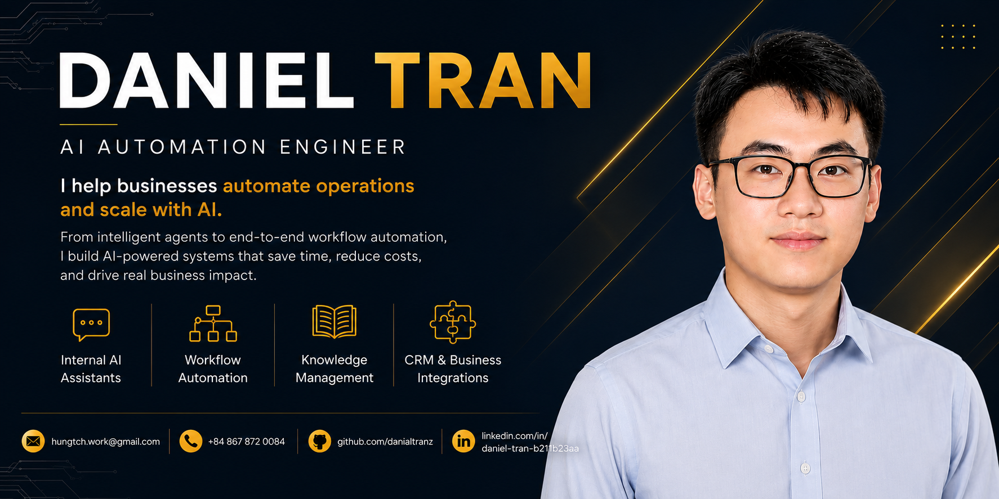
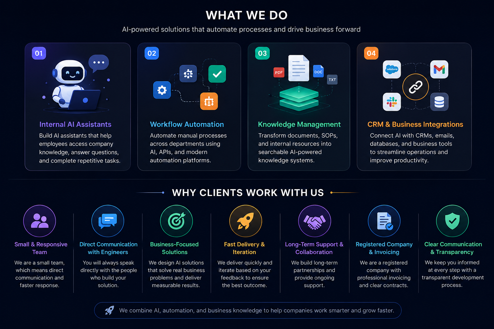

  

# Daniel Tran & Team

### AI Automation Agency

We are a team of 6 engineers based in Asia, helping businesses automate operations, reduce manual work, and scale efficiently with AI.

Our focus is not building AI demos—we build practical AI solutions that deliver measurable business results.

  

---

## Technologies

**AI & Agents**

  
  
  
  
  

**Automation**

  
  
  

**Backend & Infrastructure**

  
  
  
  
  
  
  

---

## Let's Build Together

Whether you need an internal AI assistant, workflow automation, knowledge management system, or CRM integration, we're ready to help.

  
  
  
  

